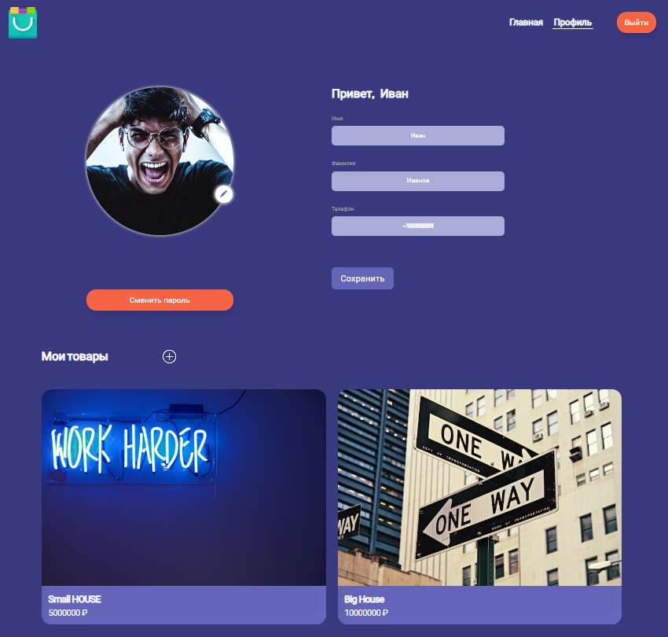

BackEnd сайта по продаже товаров
=======

## 1. Описание проекта

Бэкенд-часть проекта предполагала реализацию следующего функционала:

* #### Авторизация и аутентификация пользователей.
* #### Распределение ролей между пользователями: пользователь и администратор.
* #### CRUD для объявлений на сайте: администратор может удалять или редактировать все объявления, а пользователи — только свои.
* #### Под каждым объявлением пользователи могут оставлять отзывы.
* #### В заголовке сайта можно осуществлять поиск объявлений по названию.
* #### Показывать и сохранять картинки объявлений.

## 2. Требования 

* #### Java 11: JDK версии 11 или выше.
* #### Apache Maven: для сборки проекта.
* #### PostgreSQL: база данных.
* #### Lombok Plugin: аннотации.

## 3. Структура проекта 

- **src**: Основная директория, содержащая исходный код приложения.
    - **main**:
        - **java**: Каталог для исходных Java файлов.
            - **ru.skypro.homework**:
                - **authentication**: Класс для представления ролей
                - **config**: Конфигурация приложения
                - **controller**: Контроллеры приложения.
                - **dto**: Классы DTO.
                - **entity**: Модели для базы данных.
                - **enums**: Перечисления.
                - **exceptions**: Обработка исключений.
                - **filter**: Класс для взаимодействия с FrondEnd.
                - **logging**: Логирование приложения.
                - **mapper**: Интерфейсы для преобразования объектов.
                - **repository**: Репозитории для работы с базой данных.
                - **service**: Сервисы и бизнес-логика.
                    - **impl**: Реализации сервисов.
        - **resources**: Ресурсы проекта.
            - **liquibase**: Скрипты для изменений моделей базы.
            - **application.properties**: Конфигурационный файл приложения.
    - **test**: Каталог для тестов.
        - **java**: Тестовые Java файлы.

## 4. Установка и запуск 

Для запуска приложения вам потребуется:

#### 1 Установить Docker Desctop.
#### 2 Клонировать репозиторий и создать проект в Intellej IDEA.
#### 3 Запустить Docker Desctop.
#### 4 В терминале Intellej IDEA запустить команду: docker run -p 3000:3000 --rm ghcr.io/bizinmitya/front-react-avito:v1.21
#### 5 После выполнения этих шагов ваше приложение будет доступно по адресу http://localhost:3000/.

## 5. Используемые технологии 

|  Наименование   |                           Название задачи                           |
|:---------------:|:-------------------------------------------------------------------:|
|     Docker      |                  Запуск frontend-части приложения                   |
|      Faker      |       Генерация случайных данных для тестирования приложения        |
|       Git       |           Общая работа над проектом в процессе разработки           |
|    Hibernate    |              Настройка взаимодействия приложения с БД               |
| HTTP, REST API  | Построение контроллеров, настройка взаимодействия с frontend-частью |
|       H2        |        Встроенная база данных для разработки и тестирования         |
|     Java 11     |                      Построение логики проекта                      |
|      JUnit      |                             Unit-тесты                              |
|       IDE       |                  Среда разработки (Intellij IDEA)                   |
|    Liquibase    |              Настройка взаимодействия приложения с БД               |
|      Log4j      | Логирование ошибок, которые могут возникнуть при работе приложения  |
|    Mapstruct    |                        Создание мапперов DTO                        |
|      Maven      |                           Сборка проекта                            |
|     Mockito     |                  Unit-тесты и интеграционные тесты                  |
|   PostgresSQL   |                Создание БД, настройка доступа к ней                 |
|     Postman     |          Тестирование работы приложения в ходе разработки           |
|   Spring Boot   |                     Конфигурирование приложения                     |
| Spring Security |                 Настройка прав доступа в приложении                 |
|   Spring Web    |                       Построение контроллеров                       |
|       SQL       |  Создание таблиц в БД, установка первичных и внешних ключей таблиц  |
|     Swagger     |                        Описание API проекта                         |

## 6. Примеры кода 
#### 1. Генерация случайных данных с использованием Faker:

```java
public static UserAuthentication generateRandomUserAuthentication() {
Faker faker = new Faker();
UserAuthentication userAuthentication = new UserAuthentication();
userAuthentication.setPasswordHash(faker.internet().password());
userAuthentication.setId(1);
return userAuthentication;
}
```
#### 2. Класс с реализацией интерфейса UserDetailsService из Spring Security для загрузки пользовательских данных из базы данных PostgreSQL по их электронной почте при аутентификации пользователей:

```java
@Slf4j
@Service
@RequiredArgsConstructor
public class PostgresUserDetailsService implements UserDetailsService {

    private final JdbcTemplate jdbcTemplate;

    @Override
    public UserDetails loadUserByUsername(String email) throws UsernameNotFoundException {
        log.info("Получаем пользователя из базы по его {}", email);
        String sql = "SELECT u.email, a.password_hash, u.role FROM users u JOIN authentications a ON u.id = a.id WHERE u.email = ?";
        AtomicReference<UserDetails> userDetails = new AtomicReference<>();
```

## 7. Лицензия 

Данный проект имеет ознакомительный характер и может быть использован в учебных целях.

## 8. Авторы 

Проект реализовал Петухов Юрий.
# backend
> 
